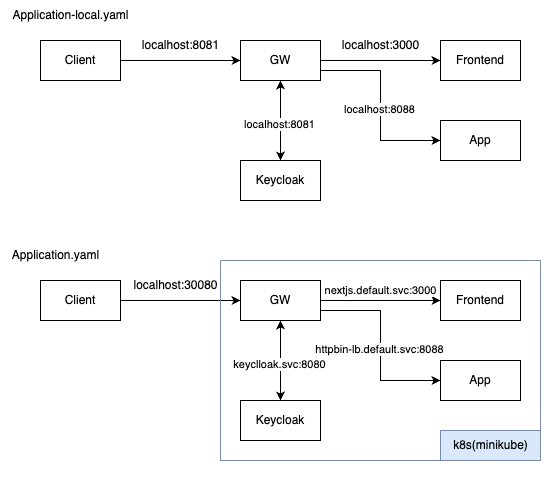

# boilerplates



## Getting started
### pull image
```shell
docker pull quay.io/keycloak/keycloak:22.0
docker pull postgres:14.5
```

### deploy service using local minikube
```shell
./minikube-start.sh
./build-gateway.sh
```

## Milestone
### auth
- [ ] keycloak initialize 구성
- [x] 로그인 화면 통해 로그인
- [x] oidc 연결 : keycloak <-> gateway
- [x] sso login (using keycloak)
- [x] tenancy 설정
  - [x] tenancy token 생성 
  - [x] gateway
  - [ ] application

### application
- [ ] 간단 웹 페이지 구성
- [x] homepage
- [ ] 로그인 성공 후 tenancy 화면

### cicd
- [x] kubernetes 구성
- [ ] keycloak initializer 구성

### observability
- [ ] zipkin tracing
- [ ] EFK 로그 수집
- [ ] grafana dashboard

### tls
- [ ] 로컬에서 https://letsencrypt.org/ko/docs/certificates-for-localhost/
- [ ] 서버에서 https://certbot.eff.org/instructions?ws=other&os=ubuntufocal

---

[](https://hits.seeyoufarm.com)
[](https://hits.seeyoufarm.com)
